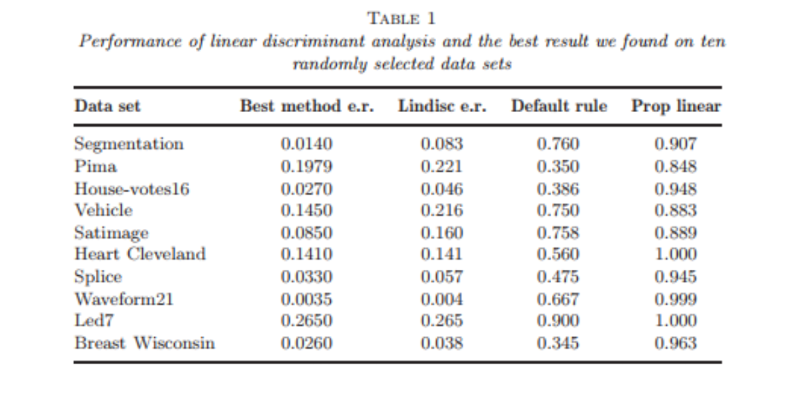
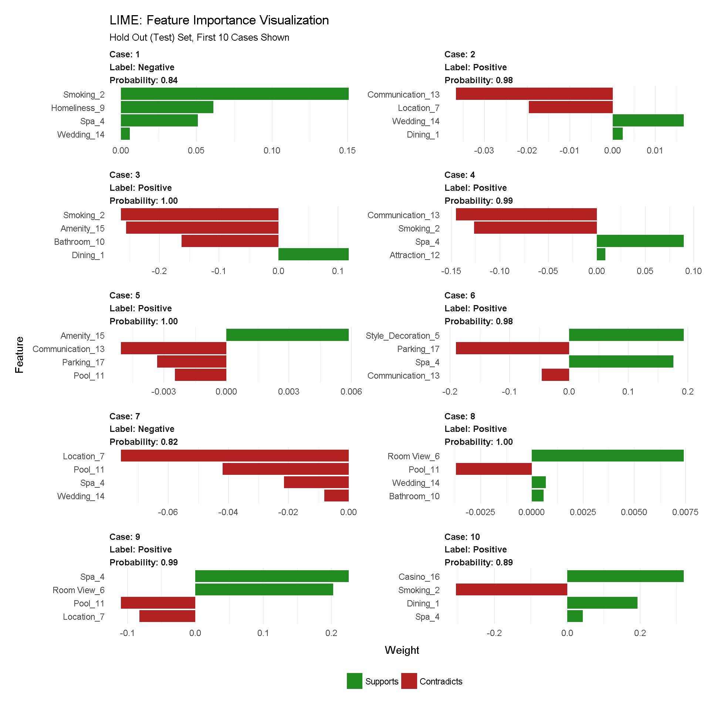

# Parts of a machine learning problem

Remember machine learning involves


But now we are trying to build a rule that can be used to predict a single observation's value of some characteristic using the others. 


Recall from last lecture that the steps in a machine learning problem are: 

1. Question definition
2. Goal setting
3. Data collection
4. Training/testing/validation splits
5. Data exploration
6. Data processing
7. Model selection and fitting
8. Model evaluation

In the first lecture we focused on a single example with the Quick, Draw! dataset. Here we are going to try to do a bit of a deeper dirve on a few different parts of the ML process. 


# Question definition

This is the most commonly missed step when developing a machine learning algorithm. ML can very easily be turned into an engineering problem. Just dump the outcome and the features into a black box algorithm and viola! 


But this kind of thinking can lead to major problems. In general good ML questions:

1. Have a plausible explanation for why the features predict the outcome. 
2. Consider potential variation in both the features and the outcome over time
3. Are consistently re-evaluated on criteria 1 and 2 over time. 

For example, there is a famous case where Google predicted Flu outbreaks based on search results. But the way people searched (due to changes in the algorithm, changes in culture, or other unexplained reasons) led to variation in the search terms people were using. This led to the algorithm predicting [wildly badly](https://gking.harvard.edu/files/gking/files/0314policyforumff.pdf) over time. 


This is just one example of a [spurious correlation](http://tylervigen.com/spurious-correlations), which is one of the big worries. In general all of Stephanie's [reasons for skepticism](https://jhu-advdatasci.github.io/2018/lectures/12-being-skeptical.html) apply here. 

# Goal setting

When we talk about the goal in ML we are usually talking about the error rate we want to minimize and how small we want to make it. Remember our notation from last time. For each observation we have an outcome $y$ and a set of features $\vec{x}$. Our goal is to create a function $\hat{y} = \hat{f}(\vec{x})$ such that the distance, $d(y,\hat{f}(\vec{x}))$, between the observed and the predicted $y$ is minimized. 

The two most common distances that show up in machine learning (and the ones you'll always be using if you don't change the defaults!) are: 

- **Root mean squared error (RMSE)** - this is the most common error measure for regression (read: continuous outcome) problems.
    - $d(y,\hat{f}(\vec{x})) = \sqrt{\sum_i \left(y_i-\hat{f}(\vec{x}_i)\right)^2}$
- **Accuracy** - this is the most common error measure for classification (read: factor outcomes) problems. 
    - $d(y,\hat{f}(\vec{x})) = \sum_i 1\left(y=\hat{f}(\vec{x})\right)$
    
But in general there are a number of other potential error measures: 


Here are a few examples of how they might be relevant. 

- **Predictive value of a positive** - in classification if one group is much less frequent than another, then even high sensitivity/high specificity tests can produce lots of false positives (the classic example is cancer screening, but very relevant for any screening problem). 
- **Mean absolute error** - in regression sometimes you want your error to be less sensitive to a few outliers (this might be true in predicting highly skewed outcomes like income or property values) and MAE can reduce the influence of those outliers. 
- **Specificity** - when the cost of a false negative is really high compared to a false positive and you never want to miss any negatives (say for example missing a person standing in front of a self driving car)

In general you need to spend a good amount of time thinking about what the _goal_ is, what the tradeoff of various different errors are and then build that into your model. 

# Data collection

You have already probably learned a lot about sampling, random sampling, confounding, and the importance of bias (I hope!). Here we'll focus on one somewhat unique issue that arises often in ML problems - the data are often huge and not sampled randomly. Tom Louis (former prof in our department) asked this question: 

>  “Which one should I trust more: a 1% survey with
60% response rate or a non-probabilistic dataset covering 80% of the population?”

There is a pretty heavy, but really [good paper](https://statistics.fas.harvard.edu/files/statistics-2/files/statistical_paradises_and_paradoxes.pdf) addressing this question by Xiao-Li Meng. The surprising answer is that it depends! If there is correlation between the outcome value and the sampling probability even huge data sets can actually be very small in "effective sample size". So it is worth thinking _very hard_ about potential correlation between the outcome and the (designed or de facto) sampling scheme. 


# Training/testing/validation splits

Recall that we talked about splitting the data into a training and testing set. In general people use these words in different ways: 


I actually like this proposal to call them "training, tuning, and testing" sets, so let's use that. 


But the reason is the same - we want to avoid being overly optimistic or "overfitting" on the training data. That would prevent us from predicting well on new samples. 


## Overfitting

Here is a funny example from [XKCD](https://xkcd.com/1122/) to illustrate overfitting


The basic idea is that if you keep adding predictors, the model will "predict well" on the data you have, no matter how well we expect it to do in the future. 

The key thing to keep in mind is that there are two types of variation in any data set, the "signal" and the "noise". Using math notation, imagine that the "real" model for a data set is: 

$$y_i = \underbrace{g(\vec{x}_i)}_{signal} + \underbrace{e_i}_{noise}$$

Let's use a concrete, simple example: 

$$y_i = \underbrace{x^2}_{signal} + \underbrace{e_i}_{noise}$$

Imagine we want to "learn" a model of the form: 

$$y_i = \sum_{k=1}^K b_k g_k(x_i) + e_i$$

Then the model 

- **Fits** if $\sum_{k=1}^K b_k g_k(x) \approx x^2$. 
- **Overfits** if $\sum_{k=1}^K b_k g_k(x) \approx x^2 + e_i$ 
- **Underfits** if $\sum_{k=1}^K b_k g_k(x) \neq x^2$

Let's simulate from the example above to give a better idea: 


```{r}
library(tibble)
library(splines)
library(modelr)
library(ggplot2)
library(dplyr)
```

```{r}
dat = tibble(x = rnorm(30),y=rnorm(30,mean=x^2))
ggplot(dat,aes(x=x,y=y)) + geom_point() + theme_minimal()
```

Now let's fit three models to this data. One that underfits, one that fits, and one that overfits. 

```{r}

# To make plotting easier later
dat  = dat %>% arrange(x)

lm_under = lm(y ~ x,data=dat)
lm_fits = lm(y ~ ns(x,df=2),data=dat)
lm_over = lm(y ~ ns(x,df=10),data=dat)

dat_pred = dat %>%
    add_predictions(lm_fits,"fits") %>%
    add_predictions(lm_under,"under") %>%
    add_predictions(lm_over,"over")

dat_pred  = dat_pred %>% gather(fit_type,fit,under,over,fits)

ggplot(dat_pred,aes(x=x,y=y)) + geom_point() + theme_minimal() + 
    geom_line(aes(x=x,y=fit,group=fit_type,color=fit_type))
```

You can kind of see that the blue line misses the signal, the red line fits pretty well, and the green line seems to capture a little too much of the noise. If we look at the errors of each approach we get: 

```{r}
dat_pred %>% mutate(res2 = (y - fit)^2) %>%
    group_by(fit_type) %>%
    summarise(rmse = sqrt(sum(res2)))
```

It looks like the overfitting approach was best, but we can probably guess that won't work on a new data set:

```{r}
dat2 = tibble(x = rnorm(30),y=rnorm(30,mean=x^2)) 
dat2_pred = dat2 %>%
    add_predictions(lm_fits,"fits") %>%
    add_predictions(lm_under,"under") %>%
    add_predictions(lm_over,"over")

dat2_pred  = dat2_pred %>% gather(fit_type,fit,under,over,fits)

ggplot(dat2_pred,aes(x=x,y=y)) + geom_point() + theme_minimal() + 
    geom_line(aes(x=x,y=fit,group=fit_type,color=fit_type))

```

Where the best model will be the one that captures the signal (which remains fixed) and not the noise (which changes). 

```{r}
dat2_pred %>% mutate(res2 = (y - fit)^2) %>%
    group_by(fit_type) %>%
    summarise(rmse = sqrt(sum(res2)))
```

## Bias variance tradeoff


Overfitting is related to another general concept - the bias variance tradeoff. In general the more predictors you have in a model the lower the bias but the higher the variance. This is called the "bias-variance tradeoff". To see this, let's fit these models in 100 simulated data sets and see what the models predict for an x value of 0 (the prediction should equal 0). 

```{r}
over = under = fits = rep(0,100)
ex_dat = tibble(x=0)
for(i in 1:100){
  new_dat = tibble(x = rnorm(30),y=rnorm(30,mean=x^2))   
  lm_under = lm(y ~ x,data=new_dat)
  lm_fits = lm(y ~ ns(x,df=2),data=new_dat)
  lm_over = lm(y ~ ns(x,df=10),data=new_dat)
  over[i] = predict(lm_over,ex_dat)
  under[i] = predict(lm_under,ex_dat)
  fits[i] = predict(lm_fits,ex_dat)
}

results = tibble(over,under,fits) %>%
    gather(type,prediction,over,under,fits)
```


The results show that when we fit the exact right model we do best (no surprise there!). When the model is too complex we get low bias (values predicted close to zero on average) but high variance. When the model isn't complex enough we get high bias (values predicted away from zero) but low variance. 

```{r}
results %>% 
    ggplot(aes(y=prediction,group=type,fill=type)) +
    geom_boxplot() +
    theme_minimal()
```

In general you won't know the true model, so the goal is to try to pick a model that gives a happy medium on the bias-variance tradeoff (of course depending on your goals). 

## What do you do in training/tuning/testing

Imagine we have broken the data into three components: $X_{tr}, X_{tu}, X_{te}$. Now we need to "fit" the model. Let's briefly talk about what this means. A machine learning model has two parts: 

1. An algorithm
2. A set of parameters

The algorithm would be something like regression models with splines: 

$$y_i = \sum_{k=1}^K b_k g_k(x_i) + e_i$$

And the parameters would be the choices of $b_k$, $g_k$ and $K$. These parameters are "fit" by estimating them from the data or fixing them in advance.


- **Training** - In the training set you try different algorithms, estimate their parameters, and see which one works best. 
- **Tuning** - Once you have settled on a single algorithm or a small set of algorithms, you use the tuning set to estimate which paramters work best outside of the training sample you originally built on. 
- **Testing** - Once your algorithm and all your parameters for your model are fixed then you apply that fitted model just one time to the test set to evaluate the error rate for your model realistically. 


## Cross validation

Within the training set you are choosing between algorithms and parameters, but like we saw above, if you use the whole training set you may end up overfitting to the noise in the data. So when selecting algorithms and parameters, you need some way to make sure you don't just pick the algorithm that is most overfit. 

The typical way people do this is by cross-validation (figure borrowed from Rafa's [Data Science Book](https://rafalab.github.io/dsbook/cross-validation-1.html)). K-fold cross validaiton just splits up the training set into K pieces. You build the model on part of the training data and apply it to the rest. This gives you a better evaluation of the out of sample error - so will allow you to rank models in a better way. 


You can also use the bootstrap. But you need to [adjust for the fact that the training and testing sets are random samples](https://www.jstor.org/stable/2965703). 


# Data exploration and processing

We talked a bunch about data exploration and processing in the first lecture. The key issue is to make sure you _look_ at your data and _think_ about what you find in it. You should do this exploration only in the training set. 

## Feature engineering

One of the key issues in building a model is feature engineering. Feature engineering is a step in a machine learning model where we construct the covariates (or features, $\vec{x}$) that you will feed into the prediction algorithms. Recall the example of the images from the previous lecture. We took data like this: 

```{r}
library(LaF)
library(rjson)
library(Hmisc)

parse_drawing = function(list)
{
  lapply(list$drawing, function(z) {data_frame(x=z[[1]], y=z[[2]])}) %>% 
    bind_rows(.id = "line") %>% mutate(drawing=list$key_id, row_id=row_number())
}

axes_json = sample_lines("axes.ndjson",100)
axes_json[[1]]
```

Then turned that into this by selecting some parts of the data we wanted:

```{r}
first_axe = rjson::fromJSON(axes_json[[1]]) %>% parse_drawing()
first_axe
```

Then made it on a standardized grid - the choice of grid is a feature. 

```{r}
grid_dat = as.tibble(expand.grid(x = 1:256,y=1:256))
grid_axe = left_join(grid_dat,first_axe) %>%
       mutate(pixel = ifelse(is.na(line),0,1))
```

Then we downsampled - the choice of how to average is another feature 
```{r}
grid_axe$xgroup = cut2(grid_axe$x,g=16,levels.mean=TRUE)
grid_axe$ygroup = cut2(grid_axe$y,g=16,levels.mean=TRUE)


grid_axe = grid_axe %>% 
    mutate(xgroup = as.numeric(as.character(xgroup)) - 7.5) %>%
    mutate(ygroup = as.numeric(as.character(ygroup)) - 7.5)


small_axe = grid_axe %>% 
    group_by(xgroup,ygroup) %>%
    summarise(pixel=mean(pixel))

small_axe

```


In general feature engineering is particularly important for "unstructured" data. For example taking a pile of text like this Emily Dickenson quote from the [tidy text tutorial](https://www.tidytextmining.com/tidytext.html): 

```{r}
library(tidytext)
text <- c("Because I could not stop for Death -",
          "He kindly stopped for me -",
          "The Carriage held but just Ourselves -",
          "and Immortality")
```

And turn it into something like counts of each word

```{r}
text_df <- data_frame(line = 1:4, text = text)

text_df %>%
  unnest_tokens(word, text) %>%
    count(word)
```


This used to be something that was almost exclusively done by expert humans, but is now often done by deep learning algorithms which do "automatic feature selection". This you'll probably learn a lot more about with neural networks. 


# Model selection and fitting


As we discussed, a lot of machine learning is considering variations on the equation:

$$d(y,f(\vec{x}))$$
where the things we are varying is the choice of distance metric $d()$ which we have already discussed. We have talked a lot less about varying $f()$ which is the most common topic for many machine learning books. Here we will briefly review a couple of the key algorithms. 

The first thing to keep in mind is that with well engineered features, often simple algorithms due almost as well as more advanced algorithms. David Hand showed this by comparing multiple algorithms to one of the simplest on a variety of prediction problems. 




The other thing to keep in mind with these types of algorithms is that there are often important tradeoffs.


The important tradeoffs are:

- Interpretability versus accuracy
- Speed versus accuracy
- Simplicity versus accuracy
- Scalability versus accuracy


## Types of models

There are a few key ideas you should know about that define most regression models you will run into in practice. 

- Regression
- Trees
- Ensembling
- Neural Networks

I'm going to focus most of my attention on Trees and Ensembling since you already probably know a lot about regression and will get a whole separate letter on neural networks. 


## Trees

Classification and regression trees are an extremely popular approach to prediction. The basic algorithm for a classification tree is the following: 

1. Start with all variables in one group
2. Find the variable/split that best separates the outcomes
3. Divide the data into two groups ("leaves") on that split ("node")
4. Within each split, find the best variable/split that separates the outcomes
5. Continue until the groups are too small or sufficiently "pure"

This is an example tree: 


The big question is how to define "best separates the outcomes" in Step 4 of the general algorithm. For continuous data you might minimize the [residual sum of squares in each group](https://rafalab.github.io/dsbook/trees-and-random-forests.html). For binary data you might measure [misclassification or information gain](https://en.wikipedia.org/wiki/Decision_tree_learning). 

- **Strengths** - Trees are usually easy to understand and can be fit quickly. 
- **Weaknesses** - Trees have a tendency not to be terribly accurate compared to some other methods and may overfit. 


## Ensembling

The other big idea that people often use in machine learning problems is called "ensembling". This idea actually underlies a number of other methods. The basic idea is to average multiple predictors to improve overall accuracy. 

To see why this might work, consider a thought experiment [from Hector Corrada Bravo](http://www.cbcb.umd.edu/~hcorrada/PracticalML/pdf/lectures/EnsembleMethods.pdf  
) via Todd Halloway. Imagine that we have 5 independent, 70% accurate classifiers. Then if we use majority vote, we need 3 of them to be right to get the answer right. This will happen with probability: 

$$(.7^3)(.3^2)+5(.7^4)(.3)+(.7^5) \approx 0.837$$ 
If we had 101 independent classifiers we would be more than 99.9% accurate. In reality generating indepenent classifiers is hard, but fitting lots of models and stacking them is still one of the most powerful approaches that is currently used. 

The first big prediction competition was the Netflix prize. The winners of this competition averaged 107 models to win: 


This used to be by far the best way to win a prediction competition until deep learning came along. But recall the tradeoffs above. As you might imagine, it is pretty slow to use a prediction model that requires 107 different predictions. In fact, it was so slow, that despite paying a million dollars to the winners of the prize, Netflix [never actually used](http://www.techdirt.com/blog/innovation/articles/20120409/03412518422/) the winning approach. 

Ensembling can be done in a couple of different ways. The two most widely used are: 


1. **Resampling based ensembling** - Repeatedly sample the training set, then build multiple models and predict with them, averaging or voting among the models to come up with the ultimate prediction. 
2. **Model stacking** - here you fit many different models to the same data set and then average them together (often in the tuning set) to get a blended model that optimally predicts the outcome. 

- **Strengths** - Ensembling is usually the most accurate approach to prediction other than well-tuned deep learning methods. 
- **Weaknesses** - Ensembling usually makes it incredibly difficult to interpret the results of your study. 


### Ensembling example - random forests

One of the most widely used ensembling strategies is the idea of [random forests](https://www.stat.berkeley.edu/~breiman/RandomForests/). The basic idea is to use resampling to build lots of trees, then average their results in prediction. 

At a [high level](https://medium.com/@williamkoehrsen/random-forest-simple-explanation-377895a60d2d) the algorithm follows this pattern: 

1. Bootstrap samples
2. At each split, bootstrap variables
3. Grow multiple trees and vote


The predictions get better as you create more trees. For example for a regression problem this is what the results look like if you plot [date versus the margin of error for a poll](https://rafalab.github.io/dsbook/trees-and-random-forests.html#random-forests). 


### Ensembling example - boosting

Boosting is another approach for creating an ensemble of prediction algorithms. Here the idea is to average many very simple classifiers to improve performance. The basic algorithm is: 


1. Start with a set of classifiers
    - Examples: All possible trees, all possible regression models, all possible cutoffs.
2. Create a classifier that combines classification functions
3. Goal is to minimize error (on training set)
    - Iterative, select one classifier at each step
    - Calculate weights based on errors
    - Upweight missed classifications and select next 

Here is an example of how that might look with linear classifiers


### Ensembling example - model stacking

The approach that Bellkor and others have used successfully is model stacking. Model stacking or model averaging involves creating multiple models on the same data set, then [averaging them together](https://www.kdnuggets.com/2017/02/stacking-models-imropved-predictions.html) with a second level model. 


Typically the first level models are fit on the training data and the second level models are fit on the testing data. 


# Model evaluation


The last step is model evaluation. A good model evaluation includes the components: 

1. Evaluation of the model predictions based on the goal you stated at the beginning of the problem. 
2. Exploratory analysis of predictions to ensure that there aren't obvious problems
3. Consideration of the practical and ethical consequences of deploying your model. 


As we discussed in the last lecture, Amazon developed an AI algorithm for predicting who they should hire. They did a good job of evaluating criteria 1 - they knew they could accurately predict in their training set. 

However, they didn't do exploratory analysis to identify what their model was using to make predictions. They also didn't do a careful job of evaluating the implications of their model in terms of bias. This [led to some major problems](https://www.reuters.com/article/us-amazon-com-jobs-automation-insight/amazon-scraps-secret-ai-recruiting-tool-that-showed-bias-against-women-idUSKCN1MK08G). 


One active and open area of research is in the interpretation of results from black box machine learning algorithms. One approach that has seen some traction is [locally interpretable model agnostic explanations](https://homes.cs.washington.edu/~marcotcr/blog/lime/). This approach fits very simple local models to approximate the complicated model in a local neighborhood. 


Then for each prediction [you can see](https://iamkbpark.com/2018/01/22/deep-learning-with-keras-lime-in-r/) how much the features are positively or negatively correlated with the complex model near that prediction. 




